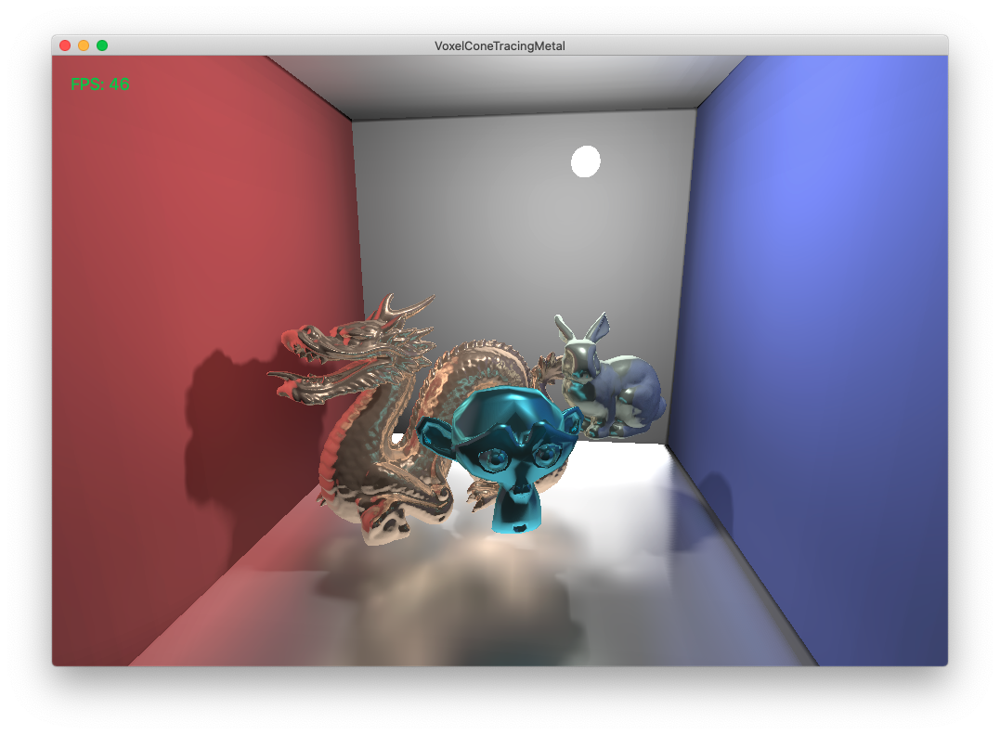

A Voxel Cone Tracing implementation for real-time global illumination using Apple's Metal Graphics API.
--------------

This is a re-implementation of original Voxel Cone Tracing written in OpenGL by Friduric
https://github.com/Friduric/voxel-cone-tracing.

Since original Voxel Cone Tracing makes use of Geometry Shader (typically available in OpenGL and Direct3D),
and Metal doesn't support Geometry Shader, this project experiments some alternative ways to implement
this technique with Metal.

What changed compare to Friduric's original OpenGL implementation
--------------

* Voxelizaton steps:
    - Method 1:
        - Use Compute Shader to generate a list of dominant axis of each triangle of a mesh.
        - Render the scene in 3 passes. Each pass project the scene to separate X/Y/Z plane.
        - Only triangles whose dominant axis is X/Y/Z will be sent to Fragment Shader in the respective
        X/Y/Z render pass.
        For example, if the triangle is being rendered in Y projection pass, but its dominant axis is X, the
        triangle will be discarded in Vertex Shader.
        - In Fragment Shader, use Metal's Raster Order Groups feature to atomically write fragment's color
        to voxel in 3D texture.
    - Method 2 (if Raster Order Groups feature not available):
        - Rasterize the scene in one single pass.
        - Compute triangle's normal vector inside Vertex Shader. Originally this is computed in Geometry
        Shader but Metal doesn't have it so calculate it inside Vertex Shader by directly reading vertex
        buffer data.
        - Project the vertex to the plane perpendicular to its dominant axis.
        - In Fragment Shader, use atomic buffer to store voxel data. Cannot write to 3D texture here since
        it seems there is no atomic function for textures read & write provided by Metal.
        - Once done, copy data from atomic buffer to 3D texture.
* Original code uses glClearTexImage to clear the 3D texture. This Metal implementation uses Compute Shader to clear.
* Cone tracing steps:
    - Basically almost the same as original implementation.
    - Note the lighting calculation might not be physically correct 100%, but the result global illumination is good
    enough.

Build Requirements
-------
* Requires MacOS 10.14+ and Xcode 10+.
* Requires no additional third-party libraries except math library glm.

Demo Hotkeys
-------
* A, S, W, D to move.
* Mouse to look around.
* T to pause the animation of some objects.
* R to switch to voxel visualization mode.
    - X, Z to control the level of details of the voxel visualizaton.
* U to toggle Indirect Diffuse Lighting.
* P to toggle Indirect Specular Lighting.
* C to toggle Shadow.
